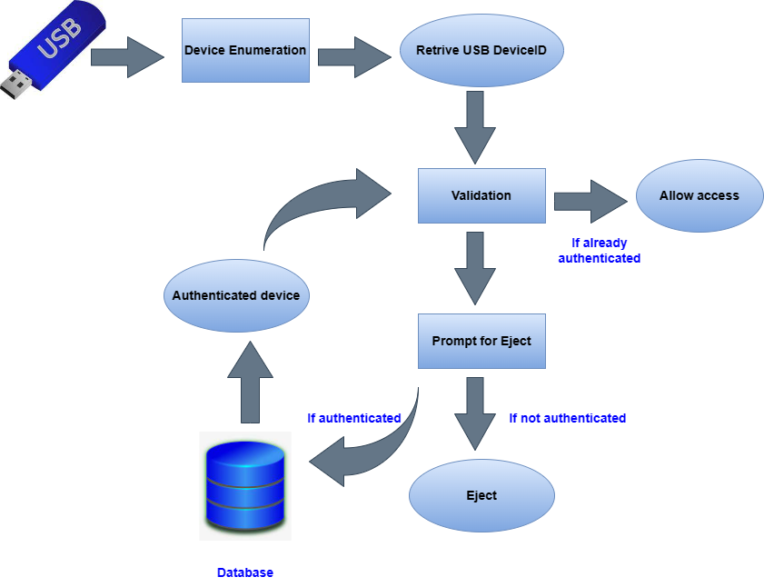

# USB Authentication Tool

[](https://github.com/17ramya/USB-authentication-Tool/actions/workflows/ci.yml)


A Windows USB device whitelist. Drives you have authorized work normally; anything
else has to be approved with a password and is **ejected** if it is not.



## How it works

1. The monitor watches the mounted removable drives (`driveletter.py`).
2. When a new drive letter appears, the PnP **DeviceID** of every connected USB
   mass-storage device is read from WMI (`auth.py`).
3. Each DeviceID is converted to a **fingerprint** (`encrypt.py`).
4. A fingerprint found in `authfile.txt` means the device is trusted - no prompt.
5. Otherwise the operator is asked for the password (`pythonpopup.py`,
   `auth1.py`). The correct password adds the device to `authfile.txt`; a refusal,
   a cancellation or too many wrong passwords ejects the drive (`eject.py`).

Devices Windows cannot identify at all are denied as well - the tool fails closed.


## Requirements

| Deployment | Needs |
| --- | --- |
| Packaged executable | Windows 10/11 (x64). Nothing else - Python is bundled. |
| From source | Windows 10/11, Python 3.9+ (3.11+ recommended), `pip install -r requirements.txt` |

Administrator rights are not required to detect, whitelist or eject a drive.
Ejecting still fails if another user has an open file on the volume - the failure
is logged and the device keeps its current state.

## Quick start (from source)

```powershell
git clone https://github.com/17ramya/USB-authentication-Tool.git
cd USB-authentication-Tool

python -m venv .venv
.\.venv\Scripts\python.exe -m pip install -r requirements.txt

# Choose the password that authorizes a new device (the plaintext is never stored)
python -c "import hashlib,getpass;print(hashlib.sha256(getpass.getpass().encode()).hexdigest())"
[Environment]::SetEnvironmentVariable("USBAUTH_PASSWORD_SHA256", "<the digest>", "User")

# Check what is visible right now
.\.venv\Scripts\python.exe main.py --list

# Start the monitor (Ctrl+C to stop)
.\.venv\Scripts\python.exe main.py
```

Prefer a salted fingerprint scheme (recommended for new installations):

```powershell
[Environment]::SetEnvironmentVariable("USBAUTH_HASH", "sha256", "User")
[Environment]::SetEnvironmentVariable("USBAUTH_SALT", "<a long random string>", "User")
```

### Running at logon

Register it as a logon task so protection survives a reboot:

```powershell
schtasks /create /tn "USB Authentication Tool" /sc onlogon /rl highest /tr "'C:\Tools\USB-Authentication-Tool.exe' --log-file 'C:\Tools\usb-auth.log'"
```

## Configuration

Everything is environment driven - no code edits, no rebuild, no reinstall.

| Variable | Default | Purpose |
| --- | --- | --- |
| `USBAUTH_PASSWORD_SHA256` | - | SHA-256 hex digest of the authorization password. **Use this:** the plaintext then never has to be stored anywhere. |
| `USBAUTH_PASSWORD` | - | Plaintext password (development only). |
| `USBAUTH_MAX_ATTEMPTS` | `3` | Wrong-password attempts before the drive is ejected. |
| `USBAUTH_AUTHFILE` | `authfile.txt` next to the program | Authorized-device list. |
| `USBAUTH_POLL_SECONDS` | `2` | How often to look for newly connected drives. |
| `USBAUTH_DRY_RUN` | `false` | Log ejections instead of performing them (rehearse a deployment safely). |
| `USBAUTH_HASH` | `legacy` | Fingerprint scheme: `legacy` (v1 compatible) or `sha256`. |
| `USBAUTH_SALT` | - | Required when `USBAUTH_HASH=sha256`. |
| `USBAUTH_LOG_LEVEL` | `INFO` | `DEBUG`, `INFO`, `WARNING` or `ERROR`. |
| `USBAUTH_LOGFILE` | - | Append logs to a file (recommended for unattended deployments). |

Bad values are rejected at start-up with a clear message, rather than failing
later at the moment a device is plugged in.

## Command line

```powershell
python main.py                                          # monitor and authenticate
python main.py --once                                   # authenticate what is connected, then exit
python main.py --list                                   # devices, fingerprints, state (read only)
python main.py --eject E:                               # eject a drive
python main.py --dry-run --once                         # rehearse without ejecting
python main.py --authfile D:\cfg\authfile.txt --poll 5 --log-file C:\Tools\usb-auth.log
```

## Deploying

### Option A - packaged executable (recommended)

```powershell
.\build.ps1                      # run the tests, then package into dist\
.\build.ps1 -Clean -SkipTests    # repackage without re-running the tests
```

Copy the single `dist\USB-Authentication-Tool.exe` to the target machine (for
example `C:\Tools\`), set `USBAUTH_PASSWORD_SHA256`, then run it or register the
logon task above. The first run creates `authfile.txt` **next to the executable**;
that file - not the executable - is what records which devices are trusted, so
back it up and keep it off version control.

### Option B - download a release

Pushing a tag makes the `Release` workflow test, package and publish the
executable together with its SHA-256 checksum:

```powershell
git tag v2.0.0
git push origin v2.0.0
```

### Option C - run from source

Install `requirements.txt` and start `main.py` (for example from Task Scheduler
with `pythonw.exe` and `USBAUTH_LOGFILE` set, so output is not lost).

## Verifying a deployment

```powershell
.\USB-Authentication-Tool.exe --version     # starts and prints the version
.\USB-Authentication-Tool.exe --list        # devices, fingerprints and their state
$env:USBAUTH_DRY_RUN = "true"
.\USB-Authentication-Tool.exe --once        # rehearse: log only, nothing is ejected
```

Then plug a device in: an authorized drive must be accepted without a prompt, an
unknown drive must show the authorization prompt, and declining it (or entering
the wrong password three times) must eject the drive.

## Files

| File | Role |
| --- | --- |
| `main.py` | Entry point (`--help` lists every option). |
| `auto.py` | Monitor loop, command line, `--list` report. |
| `auth.py` | WMI device discovery and the `authfile.txt` store. |
| `auth1.py` | Authorization policy: allow, prompt, or eject. |
| `encrypt.py` | Fingerprints - frozen legacy v1 scheme and salted SHA-256. |
| `pythonpopup.py` | Tkinter dialogs (user interface only). |
| `driveletter.py` | Removable drive enumeration. |
| `eject.py` | `IOCTL_STORAGE_EJECT_MEDIA` eject via pywin32. |
| `config.py` | Environment configuration, paths, password verification. |
| `authfile.example.txt` | Commented template for the whitelist. |
| `build.ps1`, `usb-auth.spec` | Packaging into one `.exe`. |
| `.github/workflows/` | CI (lint, tests, build) and the release pipeline. |
| `os.drawio.png`, `os proj output.jpg` | Architecture diagram and authorization prompt. |

## Security notes

* **Fails closed.** A device that cannot be identified, an empty whitelist, an
  unreadable authfile or a missing password all mean *denied* - never access.
* **No shipped password.** `USBAUTH_PASSWORD_SHA256` must be set before a new
  device can be authorized; passwords are compared in constant time.
* **The whitelist is machine specific** and is git-ignored - never publish it.
* **Fingerprints match hardware ids**, so a device cannot be talked into the
  whitelist without presenting the matching physical id.

### Limitations - know these before relying on it alone

* The monitor reacts to new **drive letters**. Devices that expose no volume
  (phones in MTP mode, HID devices, an empty card reader) are not policed, and a
  drive that is already connected at start-up is only checked via `--once`.
* Enforcement is user-mode: a local administrator can stop the process. Pair it
  with Group Policy or MDM where the control must be tamper-proof.
* A device without a unique serial number reports a location-based DeviceID, so
  its fingerprint can change when it is moved to another port.
* Ejecting can fail while another user has a file open on the volume. The failure
  is logged rather than swallowed.

## Upgrading from v1

| v1 | v2 | Why it changed |
| --- | --- | --- |
| `wmic` subprocess | WMI through pywin32 | WMIC is removed from current Windows 11 builds, so the old call failed on a fresh machine |
| `'123'` inside `pythonpopup.py` | `USBAUTH_PASSWORD(_SHA256)` | No shared, published password |
| `"" in auth_device` | `encrypt.is_match` | An unidentified device matched every entry and was reported as authenticated |
| `ctypes.windll...CreateFileW` | `win32file.CreateFile` | Handles were truncated to 32 bits on 64-bit Python |
| relative `authfile.txt` | always next to the program | Works from any working directory and inside the packaged `.exe` |
| read-modify-write | temp file + `os.replace` | An interrupted write cannot corrupt the whitelist |

`encrypt.encrypt_device_id()` is frozen on purpose, so an existing `authfile.txt`
keeps working and no device has to be re-authorized. That file is no longer
tracked in git because it records one machine's hardware; the previously
committed copy can be recovered with `git show 7deb52f:authfile.txt`.

## Development

```powershell
python -m venv .venv
.\.venv\Scripts\python.exe -m pip install -r requirements-dev.txt
.\.venv\Scripts\python.exe -m pytest        # 93 tests
.\.venv\Scripts\python.exe -m ruff check .  # lint
```

The tests never touch the real whitelist and never eject hardware: `win32api`,
`win32file` and the dialogs are replaced with stubs, so the suite also runs on
Linux CI. A handful of Windows-only tests exercise the real pywin32 modules.

## Licence

No licence file is included yet. Add one (for example MIT) before publishing -
"public repository" and "granted licence" are not the same thing.

